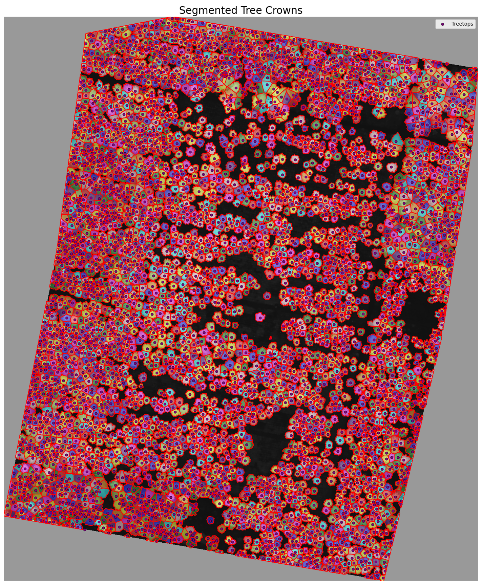

# peakfinder
script to calculate an nDSM, find tree tops, and run a marker-based watershed segmentation. 
The goal is to align tree tops with tree stem coordinates and extract uav-based tree heights from the nDSM. 

# Installation 
This package was developed and tested on Windows Server 2016 running python=3.9.

We use conda to create a new environment:

user@userpc: /peakfinder$ conda create -n py3.9
user@userpc: /peakfinder$ conda activate py3.9
(py3.9) user@userpc: /peakfinder$ conda install python=3.9 

Then we use conda to install all other packages specified in the requirements.txt:

(py3.9) user@userpc: /peakfinder$ conda install --file requirements.txt
